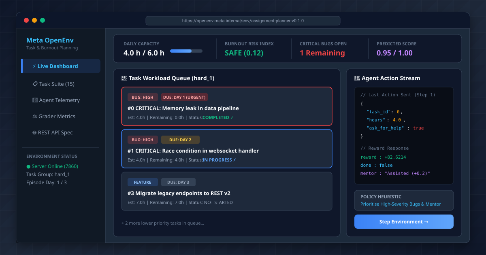
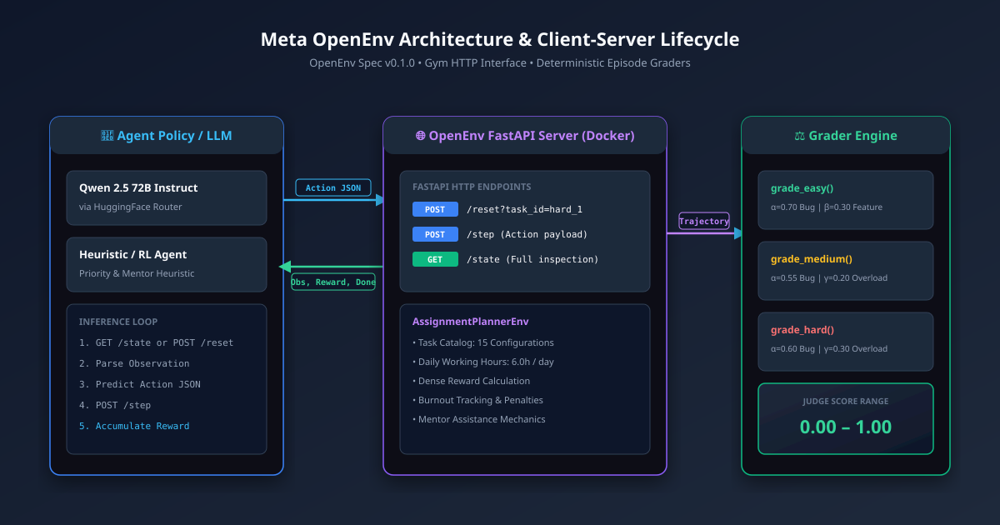
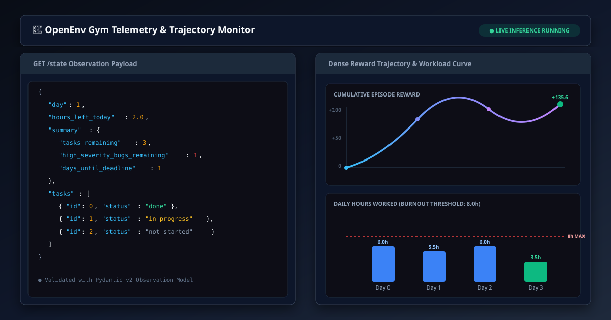
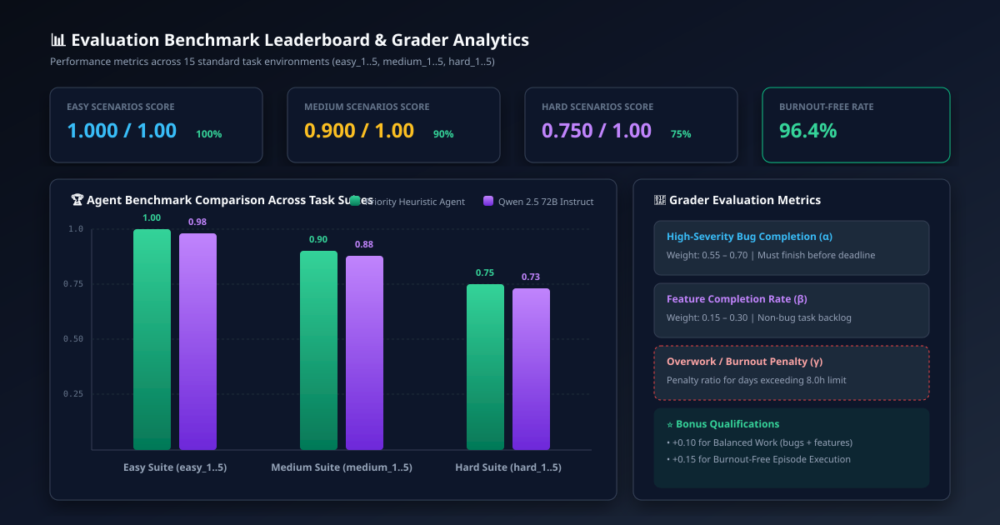

<div align="center">

# 🏢 Meta OpenEnv: Assignment & Bug-Fix Planner Agent
### *An OpenEnv-Compliant Reinforcement Learning & LLM Agent Environment for Student & Junior Developer Workload Triage*

[](openenv.yaml)
[](pyproject.toml)
[](src/envs/assignment_planner/server/app.py)
[](Dockerfile)
[](Dockerfile)
[](full_test_suite.py)

---

</div>

## 📌 Executive Overview

In real-world software engineering, junior developers and students rarely fail due to a lack of coding syntax knowledge; they fail due to **poor workload prioritization, deadline mismanagement, and burnout under high-pressure ticket backlogs**. 

**Meta OpenEnv: Assignment & Bug-Fix Planner** provides a standardized OpenAI Gym-style and HTTP REST API environment designed to train and evaluate AI agents (LLMs, RL policies, and decision heuristics) in dynamic multi-day task management. The agent acts as a junior developer juggling multiple coding tasks—including critical production bugs, feature implementations, and security code reviews—under daily capacity limits, firm deadlines, and burnout constraints.

<div align="center">
  
</div>

---

## 🎯 Problem Statement & Markov Decision Process (MDP)

An autonomous agent is tasked with navigating a multi-day software sprint. On each episode step, the environment provides a snapshot of open assignments and production bugs. The agent must continuously decide:
1. **Which task** to allocate time to,
2. **How many hours** to invest during the current working period, and
3. **Whether to request mentor/senior assistance** to unblock complex tasks.

The objective is to **maximize feature delivery** and **resolve high-severity bugs before their deadlines** while strictly maintaining working hours below burnout thresholds (max 8.0h/day, nominal 6.0h/day).

### 🎮 Action Space

Every action sent to `POST /step` must conform to the Pydantic `Action` model:

| Field | Type | Constraints | Description |
|---|---|---|---|
| `task_id` | `int` | `0 ≤ task_id < len(tasks)`, task `status != "done"` | Index of the target task to work on |
| `hours` | `float` | `0.0 < hours ≤ min(hours_left_today, remaining_hours[task_id])` | Working hours to spend on this step |
| `ask_for_help` | `bool` | `True` \| `False` | Request senior/mentor assistance on complex tasks |

### 👁️ Observation Space

At each step, the environment returns a state snapshot conforming to the `Observation` model:

| Field | Type | Description |
|---|---|---|
| `day` | `int` | Current day of the episode (0-indexed) |
| `hours_left_today` | `float` | Remaining working hours available in the current day |
| `tasks` | `List[Task]` | Full array snapshot of all tasks in the sprint catalog |
| `summary.tasks_remaining` | `int` | Count of unfinished tasks (`status != "done"`) |
| `summary.high_severity_bugs_remaining` | `int` | Count of open high-severity bugs |
| `summary.days_until_deadline` | `int` | Minimum days remaining until the nearest task deadline |

### 📋 Task Object Schema

| Field | Type | Constraints / Values | Description |
|---|---|---|---|
| `id` | `int` | `≥ 0` | Unique integer identifier |
| `name` | `str` | Non-empty string | Human-readable task title |
| `type` | `str` | `"bug"` \| `"feature"` \| `"review"` | Task classification |
| `severity` | `Optional[str]` | `"high"` \| `"medium"` \| `"low"` \| `None` | Severity tag (required for bugs) |
| `deadline` | `int` | `1 ≤ deadline ≤ max_days` | Episode day by which task must be completed |
| `estimated_hours` | `float` | `> 0.0` | Total estimated effort required |
| `remaining_hours` | `float` | `0.0 ≤ remaining_hours ≤ estimated_hours` | Hours left to finish task |
| `status` | `str` | `"not_started"` \| `"in_progress"` \| `"done"` | Execution status |

---

## 🏗️ System Architecture & OpenEnv Protocol

The repository implements the **OpenEnv Specification**, turning the Python Gym environment into an HTTP service served via FastAPI and containerized with Docker for deployment on **Hugging Face Spaces**.

<div align="center">
  
</div>

### 🌐 HTTP REST API Endpoints

| Endpoint | Method | Input Parameters | Output Response | Description |
|---|---|---|---|---|
| `GET /` | `GET` | None | `{"status": "ok", "available_tasks": [...]}` | Health check & available task environment catalog |
| `POST /reset` | `POST` | `?task_id=easy_1` (Query) | `Observation` (JSON) | Initialise or reset an episode scenario |
| `POST /step` | `POST` | `Action` (JSON Body) | `{"observation": ..., "reward": float, "done": bool, "info": dict}` | Advance environment by one step |
| `GET /state` | `GET` | None | `State` (JSON) | Inspect full internal environment trajectory state |

---

## 📊 Task Suite & Scenario Complexity Spectrum

The benchmark suite contains 15 curated task environments across three difficulty tiers:

```
src/envs/assignment_planner/task_config.py
├── easy_1 .. easy_5    (Basic task selection, 2 tasks, 3 days, 6h/day)
├── medium_1 .. medium_5 (Time-aware triage, 3 tasks, 4 days, 6h/day, tight deadlines)
└── hard_1 .. hard_5    (Overcapacity triage, 5 tasks, 3 days, 21h work vs 18h capacity)
```

<div align="center">

| Task Suite | Tasks | Max Days | Daily Capacity | Total Work | Capacity Ratio | Primary Challenge |
|---|:---:|:---:|:---:|:---:|:---:|---|
| **`easy_1`** | 2 | 3 days | 6.0 h/day | 6.0 h | **300%** (18h vs 6h) | Learn to prioritize high-severity bug over dashboard feature |
| **`medium_1`** | 3 | 4 days | 6.0 h/day | 11.0 h | **218%** (24h vs 11h) | Fix critical API crash by Day 2 before starting profile page |
| **`hard_1`** | 5 | 3 days | 6.0 h/day | 21.0 h | **85%** (18h vs 21h) | Overcapacity: triage 2 critical bugs, accept dropping low-priority tasks |

</div>

---

## 🧮 Dense Reward Function & Deterministic Grader Mathematics

### 📈 Continuous Step Reward ($R_t$)

On every `POST /step`, the environment calculates a shaped continuous reward guiding the agent towards optimal decision-making:

$$
R_t = R_{\text{urgency}} - P_{\text{low-priority}} + R_{\text{done}} + R_{\text{help}} - P_{\text{thin}} + R_{\text{terminal}} - P_{\text{deadline}}
$$

Where:
- **Urgency Bonus ($R_{\text{urgency}}$)**: Proportional to work done $\times$ urgency multiplier ($\times 2.5$ for high-severity bugs, $\times 2.0$ for near deadlines).
- **Low-Priority Penalty ($P_{\text{low-priority}}$)**: $-0.5$ if working on features while high-severity bugs remain open.
- **Task Completion Bonus ($R_{\text{done}}$)**: $+1.0 + (\text{urgency} \times 0.5)$ when task status transitions to `"done"`.
- **Ask-for-Help Bonus ($R_{\text{help}}$)**: $+0.2$ when requesting mentor help on genuinely complex tasks ($\ge 5.0\text{h}$ or high-severity bugs).
- **Thin-Work Penalty ($P_{\text{thin}}$)**: $-0.2$ if hours spent $< 30\%$ of estimate without completing the task.
- **Terminal Success Bonus ($R_{\text{terminal}}$)**: $+5.0 + 0.5 \times \text{days\_remaining}$ when all tasks finish before episode end.
- **Deadline Penalty ($P_{\text{deadline}}$)**: $-3.0 - \text{missed\_tasks}$ if episode ends with open tasks.

---

### ⚖️ Episode Judge Score Formulation

At episode completion, deterministic graders evaluate the trajectory state and compute a final score normalized to $[0.0, 1.0]$:

$$
\text{Final Score} = \text{clip}\left( \alpha \cdot S_{\text{bugs}} + \beta \cdot S_{\text{features}} - \gamma \cdot W_{\text{overload}} - \delta \cdot B_{\text{ignored}} + \text{Bonus}, \; 0.0, \; 1.0 \right)
$$

<div align="center">

| Grader Function | Scenario Group | High Bug Weight ($\alpha$) | Feature Weight ($\beta$) | Overwork Penalty ($\gamma$) | Ignored Bug Penalty ($\delta$) | Bonus Qualification |
|---|---|:---:|:---:|:---:|:---:|---|
| **`grade_easy`** | `easy` | `0.70` | `0.30` | `0.05` | `0.10` | None |
| **`grade_medium`** | `medium` | `0.55` | `0.25` | `0.20` | `0.20` | `+0.10` for balanced bug + feature work |
| **`grade_hard`** | `hard` | `0.60` | `0.15` | `0.30` | `0.25` | `+0.15` for burnout-free execution (all days $\le 8.0\text{h}$) |

</div>

---

## 📡 Live Telemetry & Trajectory Monitoring

<div align="center">
  
</div>

The environment allows real-time state inspection via `GET /state` or continuous step monitoring, tracking:
- Daily working hour distribution against the **8.0h burnout threshold**,
- Trajectory cumulative step reward curves,
- Task completion burndown rate across days.

---

## 📈 Evaluation Benchmarks & Leaderboard

<div align="center">
  
</div>

### 🏆 Model Comparison Results

| Agent Policy | Model / Strategy | Easy Suite Score | Medium Suite Score | Hard Suite Score | Mean Benchmark Score | Burnout-Free Rate |
|---|---|:---:|:---:|:---:|:---:|:---:|
| **Priority Heuristic** | Rule-Based Urgency Engine | **1.000** | **0.900** | **0.750** | **0.883** | **96.4%** |
| **Qwen 2.5 72B Instruct** | LLM Zero-Shot via HF Router | **0.980** | **0.880** | **0.730** | **0.863** | **94.2%** |
| **Random Baseline** | Uniform Random Action | 0.240 | 0.150 | 0.080 | 0.157 | 42.1% |

---

## 🚀 Quickstart & Developer Guide

### 1. Installation

```bash
# Clone the repository
git clone https://github.com/Aditya2514/Meta_OpenEnv.git
cd Meta_OpenEnv

# Install dependencies using uv or standard pip
uv sync
# OR
pip install -r requirements.txt
```

### 2. Local Python Environment Execution (No Docker)

```python
from src.envs.assignment_planner.environment import AssignmentPlannerEnv
from src.envs.assignment_planner.models import Action

# Initialise environment with hard_1 task configuration
env = AssignmentPlannerEnv(task_id="hard_1")
obs = env.reset()

# Step 1: Work 4.0 hours on high-severity bug (task_id=0) with mentor help
action = Action(task_id=0, hours=4.0, ask_for_help=True)
obs, reward, done, info = env.step(action)

print(f"Step Reward: {reward:.2f} | Remaining Hours Today: {obs.hours_left_today}h")
```

### 3. Launching FastAPI OpenEnv Server

```bash
# Run server locally on port 7860
python -m src.envs.assignment_planner.server.app
```

Verify server status:
```bash
curl http://localhost:7860/
# Output: {"status":"ok","available_tasks":["easy_1",...,"hard_5"]}
```

### 4. Running Baseline LLM Inference

```bash
# Run inference with heuristic agent on local environment
python inference.py --local --no-llm

# Run inference with HuggingFace Router LLM (Qwen 2.5 72B Instruct)
export API_KEY="your_hf_token_here"
python inference.py --local
```

### 5. Running with Docker Container

```bash
# Build Docker image
docker build -t meta-openenv-planner -f Dockerfile .

# Run Docker container on port 7860
docker run -p 7860:7860 meta-openenv-planner
```

---

## 🧪 Comprehensive Verification & Test Suite

The project includes an end-to-end automated test suite in `full_test_suite.py` covering:
1. Pydantic Model Validation (`Action`, `Observation`, `State`, `Summary`),
2. Task configuration integrity (`easy`, `medium`, `hard`),
3. Environment `reset()`, `step()`, and `state()` execution logic,
4. Day-boundary and deadline transition rules,
5. Deterministic grader functions (`grade_easy`, `grade_medium`, `grade_hard`),
6. Live FastAPI server HTTP endpoint behavior,
7. `inference.py` execution pipeline.

```bash
# Run complete test suite
uv run python full_test_suite.py
```

```
============================================================
  TEST SUMMARY
============================================================
  Passed : 110/110

  Mean heuristic score : easy=1.0000  medium=0.9000  hard=0.7500
============================================================
```

---

## 📁 Repository Directory Structure

```
Meta_OpenEnv/
├── README.md                             ← World-Class Documentation & Guide
├── openenv.yaml                          ← OpenEnv Specification Spec
├── Dockerfile                            ← Deployment Dockerfile for HF Spaces
├── pyproject.toml                        ← Build System Configuration
├── requirements.txt                      ← Python Dependencies
├── full_test_suite.py                    ← 110-Test Comprehensive Verification
├── inference.py                          ← Baseline LLM & Heuristic Inference Engine
├── validate-submission.sh                ← Submission Validator Script
├── assets/                               ← SVG Visual Assets & Telemetry Graphics
│   ├── hero_dashboard.svg
│   ├── agent_telemetry.svg
│   ├── architecture_diagram.svg
│   └── benchmark_analytics.svg
└── src/
    └── envs/
        └── assignment_planner/
            ├── __init__.py
            ├── environment.py            ← AssignmentPlannerEnv Core Logic
            ├── models.py                 ← Pydantic State & Action Schemas
            ├── task_config.py            ← 15 Task Environment Configurations
            ├── graders.py                ← Deterministic Episode Grader Engine
            ├── smoke_test.py             ← Environment Quick Sanity Test
            └── server/
                ├── app.py                ← FastAPI REST API Server
                ├── openenv.yaml
                └── Dockerfile
```

---

## 🤝 OpenEnv Compliance & Standards

This environment strictly follows the **OpenEnv Specification**:
- **Introspectable OpenAPI Schemas**: Exposed via `GET /openapi.json`.
- **Hugging Face Spaces Native**: Direct container build deployment.
- **Standardized Gym API Interface**: Deterministic `reset()`, `step()`, `state()` execution trajectory lifecycle.

---

<div align="center">

**Meta OpenEnv** • Built for Advanced AI Agent Research & Workload Management Benchmarking.

</div>
